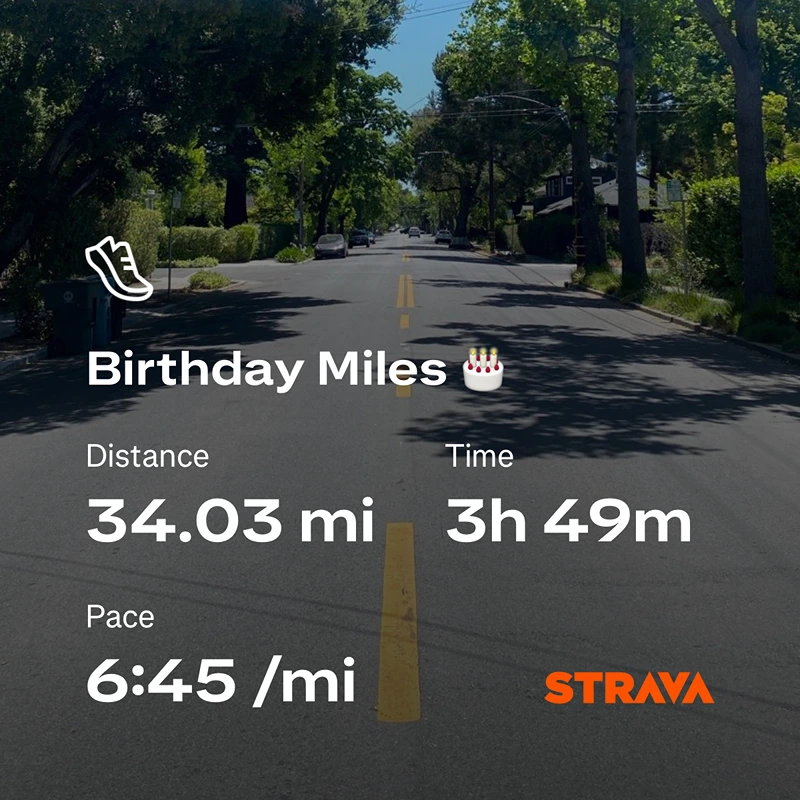

Every year on my birthday, I run my age in miles.

This year, I turned 34. So I ran 34 miles. It took me **3 hours and 53 minutes**. I burned just under 4,000 calories, held a pace of **6:45 per mile**, and hit the final mile in 6:18. I passed the marathon mark in 2:57 and crossed 50 kilometers in 3:33. A personal best for the 50km distance.

I’ve been doing this every year since I turned 30. I started running a couple of years before that, when I was 28. At the time, I had been sitting behind a desk in a 9-to-5 job and started to feel like my youth was quietly slipping away. Beyond going to the gym, I hadn’t done anything to push myself physically in years, and I realized I was getting close to passing my physical prime without ever really testing what I was capable of.

Running was a way to push back. It was simple. Hard. Honest. The birthday miles tradition started as a kind of personal challenge, but it’s become something more. A marker. A ritual.

Each year, I get better. It gets easier. I get faster. But I know that won’t always be true. One day I won’t set a new PR. One day I’ll slow down. So every year I still can is a celebration of my body and what it can do.

I never take that for granted. Health isn’t permanent. Time isn’t either. We only get so many years when we’re strong enough to do something like this. I don’t want to waste them.

