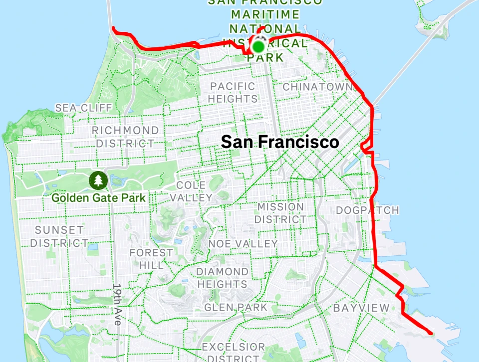

Every year on my birthday, I run my age in miles.

This year, I turned 34. So I ran 34 miles. It took me **3 hours and 53 minutes**. I burned just under 4,000 calories, held a pace of **6:45 per mile**, and hit the final mile in 6:18. I passed the marathon mark in 2:57 and crossed 50 kilometers in 3:33. A personal best for the 50km distance.

I've been doing this every year since I turned 30. I started running a couple of years before that, when I was 28. At the time, I had been sitting behind a desk in a 9-to-5 job and started to feel like my youth was quietly slipping away. Beyond going to the gym, I hadn't done anything to push myself physically in years, and I realized I was getting close to passing my physical prime without ever really testing what I was capable of.

Running was a way to push back. It was simple, hard, and honest. The birthday miles tradition started as a kind of personal challenge, and it's become something of a marker to punctuate each passing year. It's not an all-out time trial, but it's a run I do at a pace that is difficult enough to challenge myself without needing to take more than a day off afterwards to recover.

At 30, I ran my birthday miles through San Francisco, from the Marina to Hunter’s Point and back, along the Embarcadero and through the Dogpatch. It was brutally hard. My pace hovered around 8:30 per mile and I finished in 4 hours 16 minutes. The next year, at 31, I tried 50 kilometers for the first time. It felt easier, I was stronger, and I wore a CamelBak so I could stay hydrated without stopping and I came in just under four hours at about 7:40 per mile.

At 32, the run landed in the middle of a 468 mile month and one month after a 2:38 Boston Marathon. I never stopped for water, took a few gels, and covered 32 miles in 3 hours 45 minutes at roughly 7:05 per mile. At 33, I got a little complacent and put on some weight, but I still tightened the pace to 6:59 per mile.

Each year, I get better. It gets easier, and I get faster. But I know that won't always be true. One day I won't set a new personal best. Sooner or later, I'll slow down. So every year I can still cover the distance is a celebration of my health, my body, and what it can do. It really isn't about the pace, it's about proving to myself that I can still get it done.

I will never take that for granted. Health isn't permanent, and time is a non-renewable resource. We only get so many years where we're strong enough to do extraordinary things, and I don't want to waste them.
